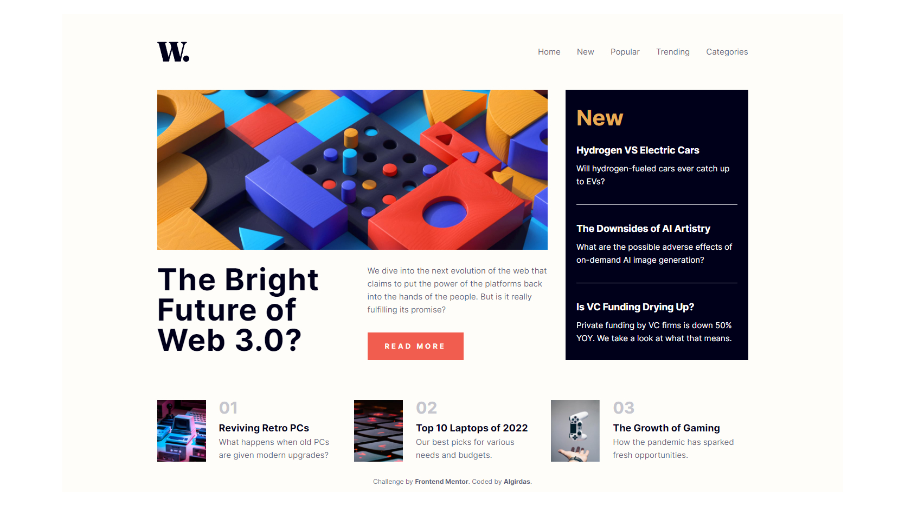
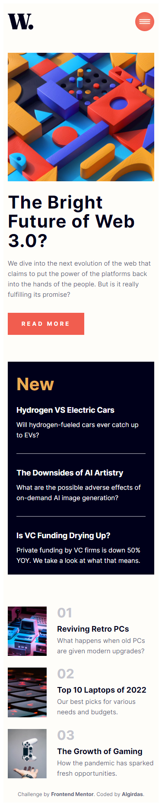
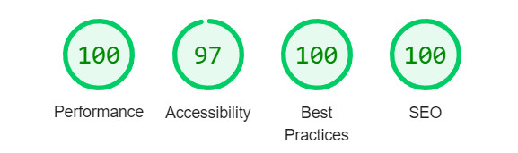

# Frontend Mentor - Clipboard landing page solution

This is a solution to the [Clipboard landing page challenge on Frontend Mentor](https://www.frontendmentor.io/challenges/clipboard-landing-page-5cc9bccd6c4c91111378ecb9). Frontend Mentor challenges help you improve your coding skills by building realistic projects. 

## Table of contents

- [Overview](#overview)
  - [The challenge](#the-challenge)
  - [Screenshot](#screenshot)
  - [Links](#links)
- [My process](#my-process)
  - [Built with](#built-with)
  - [What I learned](#what-i-learned)
  - [Useful resources](#useful-resources)
- [Author](#author)

## Overview

### The challenge

Users should be able to:

- View the optimal layout for the site depending on their device's screen size
- See hover states for all interactive elements on the page

### Screenshot

 

### Links

- Solution URL: (https://github.com/AlgirdasU/News-homepage-main)
- Live Site URL: (https://shimmering-paprenjak-c91947.netlify.app)
## My process

### Built with

- Semantic HTML5 markup
- CSS custom properties
- CSS Grid
- Flexbox
- BEM
- JS

### What I learned

My one of favorite headache on css is grid so I decided to go back and practise again. There is a side effect in certain situation that you can write responsive design without breakpoints by using just two lines of css e.g. 1) display: grid; 2) grid-template-columns: repeat(auto-fit, minmax(35rem, 1fr));

## Author

- Website - [Algirdas](https://github.com/AlgirdasU/News-homepage-main)
- Frontend Mentor - [@Algirdase](https://www.frontendmentor.io/profile/AlgirdasU)
- Twitter - [@AlgirdasDdd](https://twitter.com/algirdasddd)
